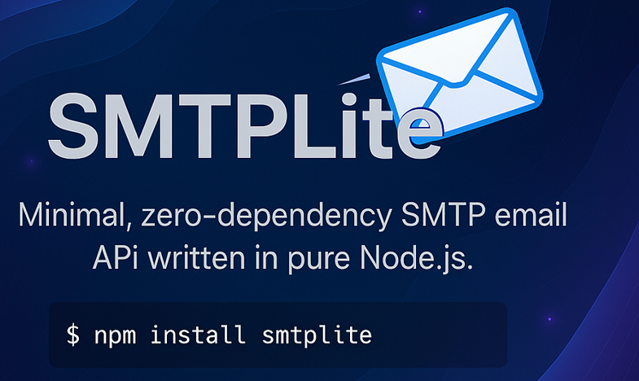

# SmtpLite

A lightweight, pure Node.js mail delivery system with no external dependencies. Perfect for Raspberry Pi and minimal environments.

## Features

- Pure Node.js implementation (no npm packages required)
- Raw SMTP communication using net.Socket with TLS/SSL support
- REST API using only http.createServer
- File-based JSON configuration (secure, no .env dependencies)
- File-based logging
- Minimal resource usage
- **NEW**: TLS/SSL support for secure SMTP (ports 587 and 465)
- **NEW**: Connection timeout protection
- **NEW**: Structured JSON logging.

## Setup

1. Clone or download this project
2. Copy the example configuration:
   ```bash
   cp config/config.example.json config/config.json
   ```
3. Edit `config/config.json` with your SMTP credentials
4. Run the server:

```bash
node server.js
```

## Configuration

### Security Note
This project uses JSON configuration files instead of .env files to eliminate external dependencies. The actual `config/config.json` file is excluded from version control via `.gitignore` to protect your credentials.

Copy `config/config.example.json` to `config/config.json` and edit with your settings:

```json
{
  "apiKey": "your-secret-api-key",
  "smtp": {
    "host": "smtp.gmail.com",
    "port": 587,
    "username": "your-email@gmail.com",
    "password": "your-app-password",
    "from": "your-email@gmail.com",
    "secure": false,
    "timeout": 10000
  }
}
```

### Why JSON Configuration?
- **Zero dependencies**: No need for dotenv or other packages
- **Native Node.js**: Uses built-in `JSON.parse()` and `fs.readFileSync()`
- **Git-safe**: Actual config file is gitignored, only example is tracked
- **Simple deployment**: Just copy and edit the example file

### SMTP Configuration Options

- `host`: SMTP server hostname
- `port`: SMTP server port (25, 587, 465)
- `username`: SMTP authentication username
- `password`: SMTP authentication password
- `from`: Default sender email address
- `secure`: Set to `true` for implicit TLS (port 465), `false` for STARTTLS (port 587)
- `timeout`: Connection timeout in milliseconds (default: 10000)

### TLS/SSL Support

- **Port 587**: Uses STARTTLS (starts plain, upgrades to TLS)
- **Port 465**: Uses implicit TLS (secure from connection start)
- **Port 25**: Plain text connection (not recommended for production)

## Usage

Send emails via GET request:

```
GET http://localhost:9090/send?key=abc123&to=test@mail.com&subject=Hello&text=Engine+Failure
```

### Parameters

- `key`: API key (must match config.json)
- `to`: Recipient email address
- `subject`: Email subject
- `text`: Email body (URL encoded)

### Response

Success (200):
```json
{
  "status": "sent",
  "to": "test@mail.com"
}
```

Error (400/403/500):
```json
{
  "error": "Error description"
}
```

## Direct Usage via require() (Without HTTP API)

SmtpLite can also be used as a Node.js module without running the HTTP server. This is useful for sending emails directly from scripts, CLI tools, or background jobs.

### Installation
```bash
npm install smtplite
```

### Example
```javascript
const SmtpClient = require('smtplite/smtp/smtpClient');

const smtpConfig = {
  host: 'smtp.gmail.com',
  port: 587,
  username: 'your-email@gmail.com',
  password: 'your-app-password', // Use Gmail App Password if 2FA is enabled
  from: 'your-email@gmail.com',
  secure: false,
  timeout: 10000
};

const client = new SmtpClient(smtpConfig);

client.sendEmail({
  to: 'recipient@example.com',
  subject: 'Hello from direct SmtpClient',
  text: 'This is a test email using direct class access.'
})
.then(() => {
  console.log('Email sent successfully');
})
.catch(err => {
  console.error('Failed to send email:', err.message);
});
```

### When to Use
- When you don't want to expose a web server or REST API
- When running email operations from scheduled tasks, CLI tools, or automation scripts
- When using SmtpLite on minimal systems like Raspberry Pi, where low resource usage is critical

## Systemd Service

Create `/etc/systemd/system/smtplite.service`:

```ini
[Unit]
Description=SmtpLite Mail Server
After=network.target

[Service]
Type=simple
User=pi
WorkingDirectory=/path/to/smtplite
ExecStart=/usr/bin/node server.js
Restart=always

[Install]
WantedBy=multi-user.target
```

Enable and start:
```bash
sudo systemctl enable smtplite
sudo systemctl start smtplite
```

## Logs

All events are logged to `logs/mail.log` in structured JSON format:

```json
{
  "timestamp": "2024-01-15T10:30:00.000Z",
  "level": "INFO",
  "event": "sendEmail",
  "message": "Email sent successfully",
  "recipient": "user@example.com",
  "subject": "Test Subject"
}
```

### Log Levels

- `INFO`: Successful operations
- `WARN`: Non-fatal issues (invalid API key, missing parameters)
- `ERROR`: Fatal errors (SMTP failures, connection timeouts)

## Security Features

- TLS/SSL encryption for SMTP connections
- Connection timeout protection (prevents hanging connections)
- API key authentication
- Structured error logging for security monitoring

⚠️ This library is intended for educational and internal use only. Use it responsibly. Mass email sending without permission may be illegal in your jurisdiction.

## ⚠️ Legal Disclaimer

This project is provided for educational and internal-use purposes only.

- Do **not** use this library for mass mailing, unsolicited messages (SPAM), or impersonation (email spoofing).
- The author assumes **no responsibility** for any misuse, data breach, or damage caused by this software.
- Make sure to comply with your local regulations (such as GDPR, KVKK, CAN-SPAM Act, etc.) when sending emails through SMTP.

Use at your own risk.

##  Deliverability Note

To improve deliverability and prevent your emails from going to the spam folder:

- Configure **SPF**, **DKIM**, and **DMARC** records for your domain.
- Use a verified domain with your SMTP provider.
- Avoid free SMTP servers (e.g., Gmail) for production usage.


## License

MIT License
